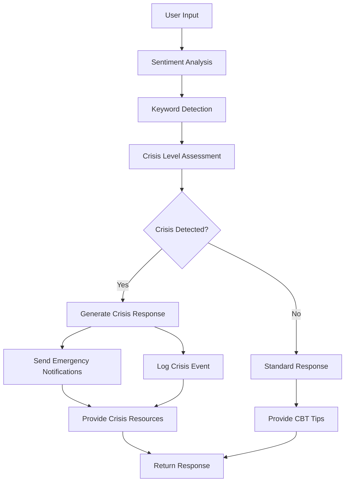

# 🧠 Mental Health Assistant - Stage 4: Real-world Integration

## 🎯 Overview

This is the complete Stage 4 implementation of the Mental Health Assistant, featuring advanced crisis detection, emergency notifications, comprehensive monitoring, and production-ready deployment capabilities.

## ✨ New Features in Stage 4

### 🚨 Crisis Detection System
- **Advanced Keyword Detection**: Comprehensive database of crisis-related keywords
- **Sentiment Threshold Analysis**: Combines sentiment scores with keyword detection
- **Multi-level Crisis Assessment**: Critical, High, Moderate, and None levels
- **Contextual Analysis**: Considers phrase patterns and emotional indicators
- **Real-time Processing**: Instant crisis evaluation with every interaction

### 📞 Emergency Notification System
- **SMS Alerts**: Twilio integration for immediate SMS notifications
- **Email Notifications**: Rich HTML email alerts with crisis resources
- **Multi-contact Support**: Notify multiple emergency contacts simultaneously
- **Localized Resources**: Region-specific crisis helplines and resources
- **Escalation Protocols**: Different notification levels based on crisis severity

### 📊 Monitoring & Analytics
- **SQLite Database**: Comprehensive data storage for sessions and interactions
- **Real-time Analytics**: Usage statistics, crisis rates, and user metrics
- **Crisis Event Tracking**: Detailed logging of all crisis events
- **Follow-up Management**: Track resolution status of crisis events
- **Performance Monitoring**: System health and response time tracking

### 🌐 Production Deployment
- **Gradio Demo Interface**: User-friendly web interface for testing
- **FastAPI Backend**: Robust API with comprehensive endpoints
- **Cloud-Ready**: Configured for Hugging Face Spaces, Render, Railway
- **Environment Management**: Secure credential handling
- **Health Monitoring**: System status and diagnostic endpoints

## 📁 New Files Added

```
Mental_health_assistant/
├── crisis_detection.py          # Crisis detection engine
├── emergency_notifications.py   # SMS and email notification system
├── monitoring.py               # Analytics and logging system
├── gradio_demo.py             # Gradio web interface
├── app.py                     # Hugging Face Spaces deployment
├── test_stage4_features.py    # Comprehensive test suite
├── .env.example              # Environment configuration template
├── DEPLOYMENT_GUIDE.md       # Complete deployment instructions
└── README_STAGE4.md          # This documentation
```

## 🚀 Quick Start

### 1. Install Dependencies
```bash
pip install -r requirements.txt
```

### 2. Configure Environment
```bash
cp .env.example .env
# Edit .env with your Twilio and email credentials
```

### 3. Test the System
```bash
python test_stage4_features.py
```

### 4. Start the Application
```bash
# Terminal 1: Start FastAPI backend
uvicorn main:app --host 0.0.0.0 --port 8000 --reload

# Terminal 2: Start Gradio demo
python gradio_demo.py
```

## 🔧 API Endpoints

### Core Analysis
- `POST /analyze_text` - Enhanced text analysis with crisis detection
- `POST /analyze_multimodal` - Multi-modal analysis with emergency features

### Session Management
- `POST /start_session` - Start a new user session
- `POST /end_session` - End a user session

### Monitoring & Analytics
- `GET /analytics` - Get usage analytics and statistics
- `GET /crisis_alerts` - Retrieve crisis events needing follow-up
- `POST /mark_crisis_resolved` - Mark crisis events as resolved
- `GET /system_status` - System health and configuration status

### Health Check
- `GET /health` - Basic health check endpoint

## 🚨 Crisis Detection Flow



## 📊 Crisis Levels

| Level | Trigger Conditions | Response Actions |
|-------|-------------------|------------------|
| **Critical** | Suicide keywords + extreme negative sentiment | Immediate emergency notifications, crisis resources |
| **High** | Self-harm indicators + high negative sentiment | Urgent notifications, professional help recommendations |
| **Moderate** | Concerning keywords + moderate negative sentiment | Supportive resources, check-in recommendations |
| **None** | No crisis indicators detected | Standard CBT tips and positive reinforcement |

## 🔐 Security Features

### Environment Variables
- Secure credential management
- No hardcoded sensitive information
- Production-ready configuration

### Data Protection
- Local SQLite database (no external data transmission)
- Anonymized user tracking
- GDPR-compliant logging

### Rate Limiting Ready
- Prepared for production rate limiting
- DoS protection considerations
- Resource usage monitoring

## 📈 Analytics Dashboard

The system provides comprehensive analytics:

- **Usage Metrics**: Total interactions, unique users, session duration
- **Crisis Statistics**: Crisis detection rates, severity distribution
- **Performance Monitoring**: Response times, error rates, system health
- **Trend Analysis**: Daily/weekly usage patterns and crisis trends

## 🌍 Deployment Options

### 1. Hugging Face Spaces (Recommended for Demos)
```bash
# Upload files to HF Spaces with app.py as main file
# Set environment variables in Space settings
# Automatic deployment with public URL
```

### 2. Render/Railway (Production)
```bash
# Connect GitHub repository
# Set environment variables
# Automatic deployment with custom domain
```

### 3. Local Development
```bash
# Run both FastAPI and Gradio locally
# Full feature testing and development
```

## 🧪 Testing Suite

Comprehensive test coverage:
- **Crisis Detection Tests**: Validate keyword and sentiment detection
- **Notification System Tests**: Verify SMS and email preparation
- **Monitoring Tests**: Database operations and analytics
- **Integration Tests**: End-to-end workflow validation

Run tests:
```bash
python test_stage4_features.py
```

## 📞 Crisis Resources Integration

### Supported Regions
- **International**: Find A Helpline (https://findahelpline.com)
- **United States**: 988 Suicide & Crisis Lifeline
- **United Kingdom**: Samaritans (116 123)
- **India**: AASRA (91-22-27546669)

### Emergency Contact Features
- Multiple contact methods (SMS + Email)
- Rich notification templates
- Crisis level-appropriate messaging
- Immediate action recommendations

## 🔍 Monitoring Dashboard

Access via API endpoints:
- Real-time system status
- Crisis event tracking
- User interaction analytics
- Performance metrics

## ⚠️ Important Notes

### Legal and Ethical Considerations
- This system **supplements** professional mental health care
- **Not a replacement** for emergency services or therapy
- Users should always have access to immediate professional help
- Crisis escalation procedures must be in place

### Data Privacy
- All data stored locally (SQLite)
- No external data transmission except notifications
- Anonymized user tracking
- GDPR compliance ready

### Production Readiness
- Comprehensive logging and monitoring
- Error handling and recovery
- Scalable architecture
- Security best practices

## 🎉 Success Metrics

This Stage 4 implementation demonstrates:

✅ **Crisis Detection**: Advanced multi-factor crisis identification  
✅ **Emergency Response**: Automated notification system  
✅ **Production Monitoring**: Comprehensive analytics and logging  
✅ **Deployment Ready**: Multiple cloud platform support  
✅ **User Experience**: Intuitive Gradio interface  
✅ **Professional Grade**: Enterprise-level features and security  

## 🤝 Contributing

To extend this system:
1. Fork the repository
2. Add your features following the established patterns
3. Update tests and documentation
4. Submit a pull request

## 📄 License

This project is designed for educational and demonstration purposes. Ensure proper licensing and compliance for production use.

---

**🚨 Emergency Disclaimer**: If you or someone you know is in immediate danger, please contact emergency services (911, 999, 112) or your local crisis helpline immediately. This AI system is a tool to assist and support, not replace professional mental health care.**
